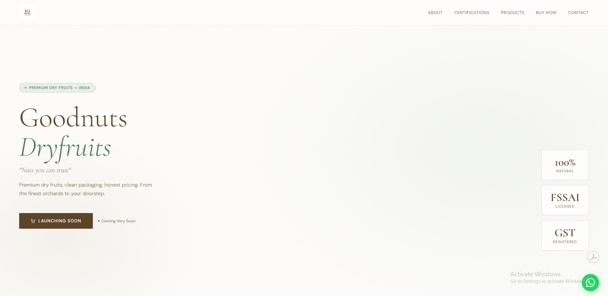

# Goodnuts Dryfruits — Brand Website

A premium landing page for **Goodnuts Dryfruits**, a real Indian dry fruits brand.
Live at: [goodnuts.in](https://goodnuts.in)

---

## About the Project

Built a complete brand website from scratch for a real business — 
from design and coding to live deployment with a custom domain.

---

## What's on the Website

- Hero section with brand identity and tagline
- About the brand — sourcing, hygiene, pricing philosophy
- Government certifications — FSSAI license and GST number displayed
- Product showcase — Almonds, Cashews, Pistachios, Raisins with real product images
- Buy Now section with launch announcement
- Contact section with WhatsApp integration
- Fully responsive — works on mobile and desktop

---

## Tech Used

- HTML5 & CSS3 (no frameworks — pure code)
- Google Fonts (Cormorant Garamond + DM Sans)
- CSS animations and scroll reveal effects
- Base64 embedded images (single file deployment)

---

## Deployment

- Hosted on **Netlify** (free tier)
- Custom domain **goodnuts.in** purchased on GoDaddy
- DNS configured via Netlify DNS with full nameserver transfer
- HTTPS enabled with free SSL certificate

---

## What I Learned

- Building a production-ready website from scratch
- Brand identity implementation through typography, color and layout
- Netlify deployment and continuous deployment workflow
- Domain purchasing, DNS management and nameserver configuration
- How DNS propagation works and how to troubleshoot it

---

## Screenshots

---

## Live Site

[https://goodnuts.in](https://goodnuts.in)
